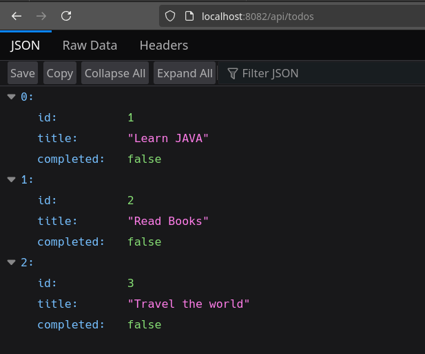
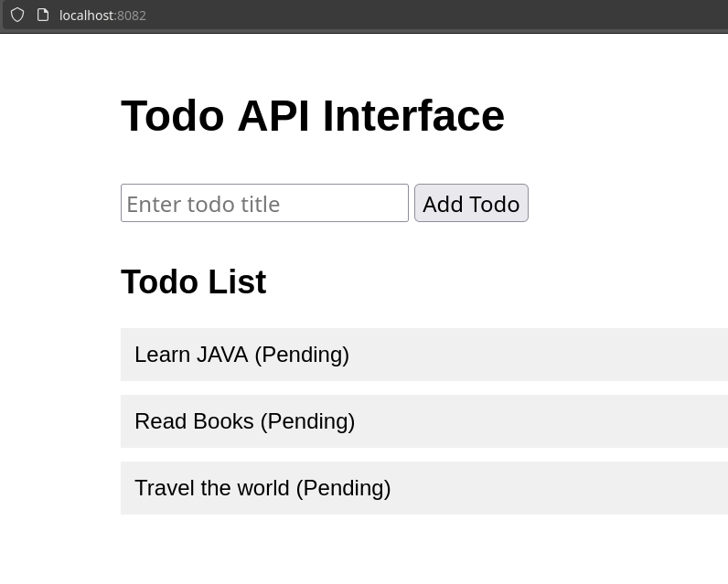

# ToDoApi -JAVA


Project description - building a RESTful API for a ToDo app 
to help me understand the basics of REST, HTTP methods, using JAVA and Spring Boot.

The project is a simple ToDo API that allows us to create, read, update, and delete Todo items - used as a practice scenario.


1. `Todo.java`: This is our model class representing a Todo item. It has fields for id, title, and completion status.

2. `TodoRepository.java`: This interface extends JpaRepository, which provides basic CRUD operations for our Todo entity.

3. `TodoController.java`: This is our REST controller that handles HTTP requests. It defines endpoints for creating, reading, updating, and deleting Todo items.

4.To present it in a nice way, I also added a static HTML file that presents a simple interface listing of Todos. This file is located in the `src/main/resources/static` directory. 

To run the application:

1. Make sure you have Java and Maven installed on your system.
2. Navigate to the project directory in your terminal.
3. Run the command: `mvn spring-boot:run`

My API will be available at `http://localhost:8082/api/todos`.

We can API using tools like Postman or cURL by requesting the following endpoints:

1. Create a new Todo:
   ```
   POST http://localhost:8082/api/todos
   Content-Type: application/json

   {
     "title": "Learn REST API"
   }
   ```

2. Get all Todos:
   ```
   GET http://localhost:8082/api/todos
   ```

3. Get a specific Todo:
   ```
   GET http://localhost:8082/api/todos/1
   ```

4. Update a Todo:
   ```
   PUT http://localhost:8082/api/todos/1
   Content-Type: application/json

   {
     "title": "Learn Java",
     "completed": true
   }
   ```

5. Delete a Todo:
   ```
   DELETE http://localhost:8082/api/todos/1
   ```

This project covers the basics of building a RESTful API, including:

- Using HTTP methods (GET, POST, PUT, DELETE)
- Working with JSON for request and response bodies
- Implementing CRUD operations
- Using Spring Boot for easy setup and configuration
- Basic error handling


   
   